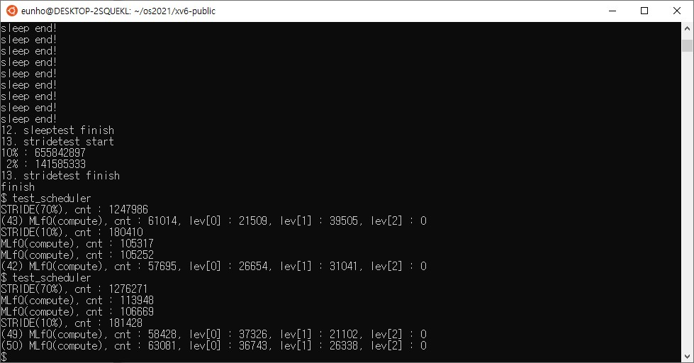
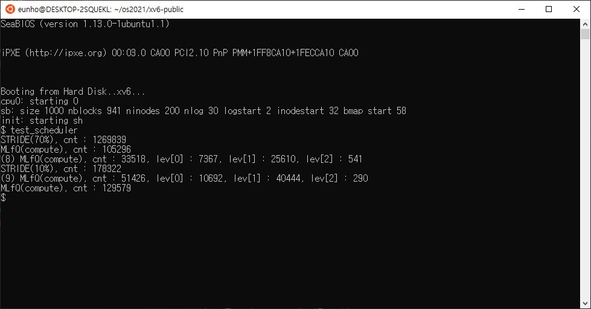

# Analysis

test_thread와 test_thread2 모두 정상적으로 작동하였다.

다만 기존의 test_thread2의 sleeptest로는 thread가 제대로 sleep에 빠졌다가 다시 wakeup이 되어 정상적으로 스케쥴링이 되는지 확인할 수 없었기 때문에, 해당 코드부만 아래의 코드로 변경하였다.

```c
void*
sleepthreadmain(void *arg)
{
  sleep(1000);
  printf(1, "sleep end!\n");
  thread_exit(0);

  return 0;
}

int
sleeptest(void)
{
  void *retval;
  thread_t threads[NUM_THREAD];
  int i;

  for (i = 0; i < NUM_THREAD; i++){
    if (thread_create(&threads[i], sleepthreadmain, (void*)i) != 0){
        printf(1, "panic at thread_create\n");
        return -1;
    }
  }
  sleep(10);
  for (i = 0; i < NUM_THREAD; i++){
    if (thread_join(threads[i], &retval) != 0){
      printf(1, "panic at thread_join\n");
      return -1;
    }
  }
  return 0;
}
```

해당 코드 수행시 정상적으로 sleep에 빠져 약 10초(1000 tick) 후 "sleep end!"를 출력하였다.


- *전체 테스트 코드는 `test_thread.c`와 `test_thread2.c`를 참고*


#### Scheduler Optimization으로 인한 스케쥴링 변화에 대한 분석



한번의 차례당 주어지는 tick, 즉 time quantum이 5배로 길어진데 비해 `priority_boost()`의 호출 주기는 2배로 늘어졌기 때문에, MLFQ에서 level 2까지 내려가는 경우가 확연히 줄어든 것을 알 수 있다. 사진의 testcase에서는 아예 level 2로 내려가지 않는 경우도 발생함을 보여준다.

*아래는 `priority_boost()`의 호출 주기를 **500 tick**으로 설정하였을 때의 결과이다. *



다만 `priority_boost()`의 너무 넓은 주기는 starvation을 초래할 수 있기 때문에, 200 ticks로 설정하였다.
