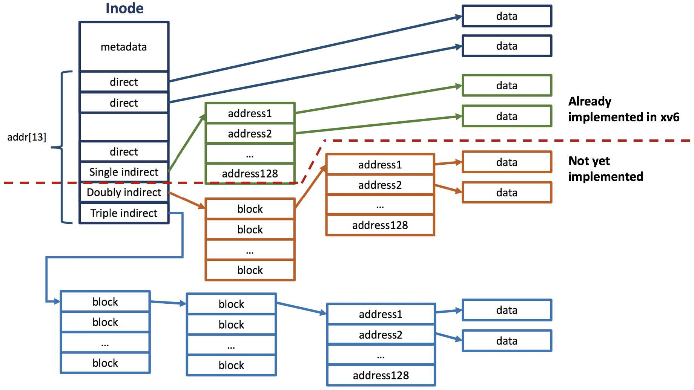

# Multiple Indirect Blocks




### inode 구조 변경을 위한 변경사항

기존 inode는 DIRECT Block이 12개였으나, 10개로 줄어들고 Double Indirect Block과 Triple Indirect Block이 추가된다.

```c
//fs.h
#define NDIRECT 10
#define NINDIRECT (BSIZE / sizeof(uint))
#define NDOUBLEINDIRECT (NINDIRECT * NINDIRECT)
#define NTRIPLEINDIRECT (NINDIRECT * NDOUBLEINDIRECT)
#define MAXFILE (NDIRECT + NINDIRECT + NDOUBLEINDIRECT + NTRIPLEINDIRECT)

// On-disk inode structure
struct dinode {
  //...생략...
  uint addrs[NDIRECT+3];   // Data block addresses
};
```

```c
//file.h
// in-memory copy of an inode
struct inode {
  // ...생략...
  uint addrs[NDIRECT+3];
};
```


파일 시스템의 Block수를 최대 File size의 4배로 설정하였다. (기존 1000, 변경 이후 8454696)

```c
//param.h
#define FSSIZE       (int)(4 * (10 + (512 / sizeof(uint)) + ((512 / sizeof(uint)) * (512 / sizeof(uint))) + ((512 / sizeof(uint)) * (512 / sizeof(uint)) * (512 / sizeof(uint))))) 
```


`bmap()`과 `itrunc()`에서 Double Indirect Block과 Triple Indirect Block에 대한 처리를 추가하였다. 재귀함수로 구성할까 하였으나 branch로 인한 overhead가 불필요하게 발생하기 때문에 (Triple의 경우)3중 for문으로 구성하였다.

```c
//fs.c
static uint
bmap(struct inode *ip, uint bn)
{
  //...생략... (NINDIRECT 까지의 mapping)
  bn -= NINDIRECT;

  if(bn < NDOUBLEINDIRECT){ //DOUBLE INDIRECT BLOCK에 속한 경우
    if((addr = ip->addrs[NDIRECT+1]) == 0)
      ip->addrs[NDIRECT+1] = addr = balloc(ip->dev);
    bp = bread(ip->dev, addr);
    a = (uint*)bp->data;
    if((addr = a[bn / NINDIRECT]) == 0){
      a[bn / NINDIRECT] = addr = balloc(ip->dev);
      log_write(bp);
    }
    brelse(bp);

    bp = bread(ip->dev, addr);
    a = (uint*)bp->data;
    if((addr = a[bn % NINDIRECT]) == 0){
      a[bn % NINDIRECT] = addr = balloc(ip->dev);
      log_write(bp);
    }
    brelse(bp);
    return addr;
  }
  bn -= NDOUBLEINDIRECT;

  if(bn < NTRIPLEINDIRECT){ //TRIPLE INDIRECT BLOCK에 속한 경우
    if((addr = ip->addrs[NDIRECT+2]) == 0)
      ip->addrs[NDIRECT+2] = addr = balloc(ip->dev);
    bp = bread(ip->dev, addr);
    a = (uint*)bp->data;
    if((addr = a[bn / NDOUBLEINDIRECT]) == 0){
      a[bn / NDOUBLEINDIRECT] = addr = balloc(ip->dev);
      log_write(bp);
    }
    brelse(bp);
    bp = bread(ip->dev, addr);
    a = (uint*)bp->data;
    if((addr = a[bn % NDOUBLEINDIRECT / NINDIRECT]) == 0){
      a[bn % NDOUBLEINDIRECT / NINDIRECT] = addr = balloc(ip->dev);
      log_write(bp);
    }
    brelse(bp);
    bp = bread(ip->dev, addr);
    a = (uint*)bp->data;
    if((addr = a[bn % NINDIRECT]) == 0){
      a[bn % NINDIRECT] = addr = balloc(ip->dev);
      log_write(bp);
    }
    brelse(bp);
    return addr;
  }

  panic("bmap: out of range");
}


static void
itrunc(struct inode *ip)
{
  int i, j, k, l;
  struct buf *bp, *bpp, *bppp;
  uint *a, *aa, *aaa;

  //...생략... (NDIRECT까지의 itrunc)

  if(ip->addrs[NDIRECT+1]){    //DOUBLE INDIRECT BLOCK이 0이 아닐 경우
    bp = bread(ip->dev, ip->addrs[NDIRECT+1]);
    a = (uint*)bp->data;
    for(j = 0; j < NINDIRECT; j++){
      if(a[j]){
        bpp = bread(ip->dev, a[j]);
        aa = (uint*)bpp->data;
        for(k = 0; k < NINDIRECT; k++){
          if(aa[k])
            bfree(ip->dev, aa[k]);
        }
        brelse(bpp);
        bfree(ip->dev, a[j]);
        a[j] = 0;
      }
    }
    brelse(bp);
    bfree(ip->dev, ip->addrs[NDIRECT+1]);
    ip->addrs[NDIRECT] = 0;
  }

  if(ip->addrs[NDIRECT+2]){    //TRIPLE INDIRECT BLOCK이 0이 아닐 경우
    bp = bread(ip->dev, ip->addrs[NDIRECT+1]);
    a = (uint*)bp->data;
    for(j = 0; j < NINDIRECT; j++){
      if(a[j]){
        bpp = bread(ip->dev, a[j]);
        aa = (uint*)bpp->data;
        for(k = 0; k < NINDIRECT; k++){
          if(aa[k]){
            bppp = bread(ip->dev, aa[k]);
            aaa = (uint*)bppp->data;
            for(l = 0; l < NINDIRECT; l++){
              if(aaa[l])
                bfree(ip->dev, aaa[l]);
            }
            brelse(bppp);
            bfree(ip->dev, aa[k]);
            aa[k] = 0;
          }
        }
        brelse(bpp);
        bfree(ip->dev, a[j]);
        a[j] = 0;
      }
    }
    brelse(bp);
    bfree(ip->dev, ip->addrs[NDIRECT+2]);
    ip->addrs[NDIRECT] = 0;
  }
    

  ip->size = 0;
  iupdate(ip);
}
```
