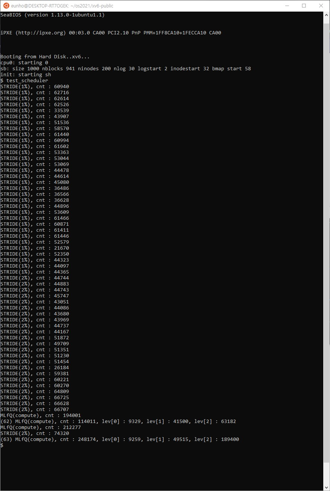
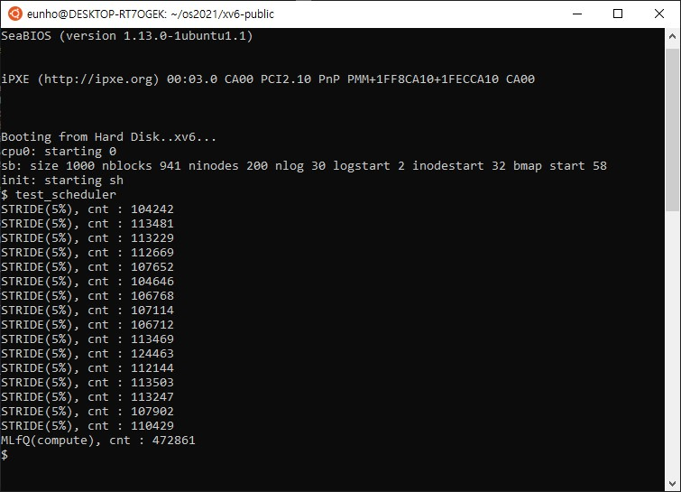
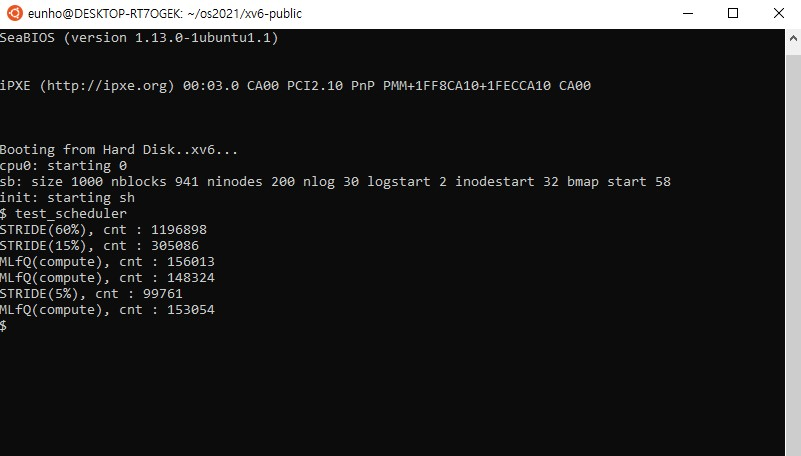

# Analysis

* 해당 Project의 스케쥴러 구동의 주요 코드부는 아래의 파일과 함수들을 참고하면 된다.
  * **trap.c**
    * **trap()** - syscall과 timer interrupt 처리부 (syscall에서는 sys_yield와 sys_sleep에 대한 예외처리 / timer interrupt에서는 프로세스 level에 따라 timeslice 만큼 동작 보장)
  * **proc.c**
    * **scheduler()**
    * **allocproc()** - 프로세스 노드 변수값들 초기화
    * **userinit()** - userinit process node의 mlfq_0 로의 push
    * **fork()** - fork로 생성되는 process(userinit을 제외한 모든 process) node의 mlfq_0로의 push
    * **priority_boost()**
    * **set_cpu_share()**
    * **queue_init()** - scheduler queue header 초기화
    * 기타 **queue_${FUNCTION}()** 함수들 - queue 관리
  * **sysproc.c**
    * **sys_set_cpu_share()**
    * **sys_getlev()**
    * **sys_yield()**
  * **main.c**
    * **main()** - queue_intit() 호출

### test case 1

case 1과 2는 동일 환경으로, mlfq의 프로세스들은 모두 비슷한 동작 시간을 가진 동일한 코드로 구성되어 있어 mlfq 내에서도 비슷한 점유율을 가지게 된다.

총 요구 점유율은 (5 + 15 + 10 + 1 + 20 + 20 =) 71%이다.

mlfq에 20프로 가량을 할당해준 외 나머지 약 29%는 stride의 process들이 나누어 갖는 것을 관찰할 수 있다.

|                 | expected share(%) | counts  | mesured share(%) |
| --------------- | ----------------- | ------- | ---------------- |
| **stride 5%**   | 5                 | 152642  | 7.92             |
| **stride 15%**  | 15                | 448039  | 23.27            |
| **stride 10%**  | 10                | 304046  | 15.79            |
| **stride 1%**   | 1                 | 37759   | 1.96             |
| **stride 20%**  | 20                | 588024  | 30.54            |
| **mlfq levcnt** | 4                 | 75656   | 3.92             |
| **mlfq levcnt** | 4                 | 75459   | 3.91             |
| **mlfq levcnt** | 4                 | 76229   | 3.95             |
| **mlfq levcnt** | 4                 | 77468   | 4.02             |
| **mlfq levcnt** | 4                 | 89807   | 4.66             |
| **mlfq total**  | 20                | 394619  | 20.49            |
| **total**       |                   | 1925129 |                  |

### test case 2

|                 | expected share(%) | counts  | mesured share(%) |
| --------------- | ----------------- | ------- | ---------------- |
| **stride 5%**   | 5                 | 147636  | 8.36             |
| **stride 15%**  | 15                | 437513  | 24.77            |
| **stride 10%**  | 10                | 189650  | 10.74            |
| **stride 1%**   | 1                 | 35789   | 2.02             |
| **stride 20%**  | 20                | 566857  | 32.10            |
| **mlfq levcnt** | 4                 | 72391   | 4.09             |
| **mlfq levcnt** | 4                 | 71825   | 4.06             |
| **mlfq levcnt** | 4                 | 71952   | 4.07             |
| **mlfq levcnt** | 4                 | 80477   | 4.55             |
| **mlfq levcnt** | 4                 | 91694   | 5.19             |
| **mlfq total**  | 20                | 388339  | 21.99            |
| **total**       |                   | 1765784 |                  |

### test case 3

이번 test case의 경우 yield를 호출하는 mlfq process로 인해 mlfq가 본인의 share만큼의 점유율을 보장받지 못한다.

이는 프로세스가 스스로 점유를 포기한 경우에도 한 턴을 소모한 것으로 간주하기 때문에 발생한다. 이에 따라 다른 stride process들이 이 수혜를 나누어 갖게 된다.

|                       | expected share(%) | counts  | mesured share(%) |
| --------------------- | ----------------- | ------- | ---------------- |
| **stride 5%**         | 5                 | 136551  | 6.60             |
| **stride 15%**        | 15                | 387562  | 18.74            |
| **stride 10%**        | 10                | 259182  | 12.53            |
| **stride 20%**        | 20                | 510479  | 24.68            |
| **stride 20%**        | 20                | 503359  | 24.34            |
| **mlfq none**         |                   | 121744  | 5.88             |
| **mlfq levcnt yield** |                   | 25      | 0.001            |
| **mlfq levcnt yield** |                   | 30      | 0.001            |
| **mlfq levcnt**       |                   | 68369   | 3.30             |
| **mlfq levcnt**       |                   | 80288   | 3.88             |
| **mlfq total**        | 20 - alpha        | 270456  | 13.08            |
| **total**             |                   | 2067589 |                  |

### test case 4

전체 요구 점유율의 합계는 90%인 case이다.

mlfq 내의 프로세스가 종류가 다르기 때문에, 다른 점유율을 보인다. (levcnt가 none보다 Instruction Count가 많기 때문에 priority가 후순위로 밀리게 되고, 이에 따라 none보다 낮은 점유율을 보이게 된다.)

남은 10%의 점유율에 대해서는 대체적으로 mlfq를 제외한 stride 의 process들이 나누어 가지는 경향을 보인다.

|                 | expected share(%) | counts  | mesured share(%) |
| --------------- | ----------------- | ------- | ---------------- |
| **stride 5%**   | 5                 | 133490  | 6.56             |
| **stride 15%**  | 15                | 343363  | 16.87            |
| **stride 10%**  | 10                | 231621  | 11.38            |
| **stride 20%**  | 20                | 450447  | 22.14            |
| **stride 20%**  | 20                | 438025  | 21.53            |
| **mlfq none**   |                   | 103028  | 5.06             |
| **mlfq none**   |                   | 105987  | 5.20             |
| **mlfq none**   |                   | 107728  | 5.29             |
| **mlfq levcnt** |                   | 59258   | 2.91             |
| **mlfq levcnt** |                   | 61358   | 3.01             |
| **mlfq total**  | 20                | 437359  | 21.49            |
| **total**       |                   | 2034305 |                  |

### test case 5

5번째 test case에서는 share를 모두 나누어 가지는 경우이다.

이 경우 아래와 같이 예상 점유율과 가장 근접한 점유율이 나온다.

|                 | expected share(%) | counts  | mesured share(%) |
| --------------- | ----------------- | ------- | ---------------- |
| **stride 5%**   | 5                 | 106782  | 5.15             |
| **stride 15%**  | 15                | 316651  | 15.27            |
| **stride 10%**  | 10                | 216378  | 10.43            |
| **stride 20%**  | 20                | 411715  | 19.86            |
| **stride 30%**  | 30                | 606055  | 29.23            |
| **mlfq none**   |                   | 95392   | 4.60             |
| **mlfq none**   |                   | 98454   | 4.74             |
| **mlfq none**   |                   | 98440   | 4.74             |
| **mlfq levcnt** |                   | 53996   | 2.60             |
| **mlfq levcnt** |                   | 68939   | 3.32             |
| **mlfq total**  | 20                | 415221  | 20.03            |
| **total**       |                   | 2072802 |                  |

### test case 6

6번째 test case는 56개의 stride process와 4개의 mlfq process 로 구성되어 있다.

결과를 보면 1%인 process와 2%인 프로세스의 점유율이 같게 나오지만,

set_cpu_share 호출 시 기존 stride process들의 distance가 초기화 된다는 점 때문에 이처럼 보이는 것이다.

먼저 stride에 진입한 process는 더 많이 거리가 초기화 되므로, 실질적으로는 점유율을 더 많이 가지는 것처럼 보이는 것이다. 이는 먼저 호출된 1% 점유율을 요구하는 process의 cnt가 더 높은 경향을 보이는 것을 통해 추론할 수 있다.

이는 여러 stride process들의 요구 점유율을 5%로 늘려 최대치로 채워 시행한 test case 7을 통해 유추해 낼 수 있다.

### test case 7

cnt값의 오차 범위는 대략 1000 정도로 점유율 기준으로 대략 1%정도의 오차범위이다. 이 오차범위는 1~2 % 기준으로는 크지만 5% 이상으로 갈 경우 실질적으로 영향이 큰 정도의 오차는 아니게 된다.

결국 5% 이하의 점유율에 대해서는 오차 범위가 1%내외인  점으로 인하여 (set_cpu_share 동작 방식, 그리고 테스트 코드의 동작 방식등으로 인한 오차 또한 존재) 정밀한 점유율 보장은 힘들지만,

장기적인 관점에서, 그리고 대략적인 CPU 점유율 요구에 대해서는 오차 범위 내의 보장은 가능하다는 점을 알 수 있다.

### test case 8

case 8의 경우, MLFQ가 약 2%정도의 점유율을 더 가져가는 것을 관찰할 수 있다.

이는 STRIDE 내에서 MLFQ가 20%이상을 점유할 수 있도록 하기 위해, 그리고 MLFQ 프로세스의 LEVEL별 timeslice를 지켜주기 위한 동작 방식 때문이다.

MLFQ는 STRIDE 내의 다른 프로세스들이 무조건 4tick의 time slice를 가지고 동작하는 것과 다르게, MLFQ 내부의 프로세스가 끝난 후 소모된 tick이 4 이상이면 MLFQ의 턴을 종료하게 된다. 즉, 1 LEVEL 프로세스 동작(2 tick) 후 2 LEVEL 프로세스가 동작(4 tick)할 경우 한 턴에 6틱을 보장받게 된다. 해당 현상이 전체 비율에 비하면 빈번하지는 않지만, (priority boost가 일어날 때 마다 LEVEL 0 - LEVEL 1 에서 1 tick over, LEVEL 1 - LEVEL 2 에서 2 tick over 하여 3 ticks per priority boost 만큼 더 동작한다) 해당 현상으로 인해 MLFQ는 약 2~3%의 점유율을 추가로 갖게 된다.

이전의 MLFQ_LEVCNT의 경우에 20에 가깝게 점유율이 나타난 것은, LEVCNT의 경우 getlev 호출로 인해 cnt가 실제 점유율보다 약간 적게 나타나기 때문이다.

