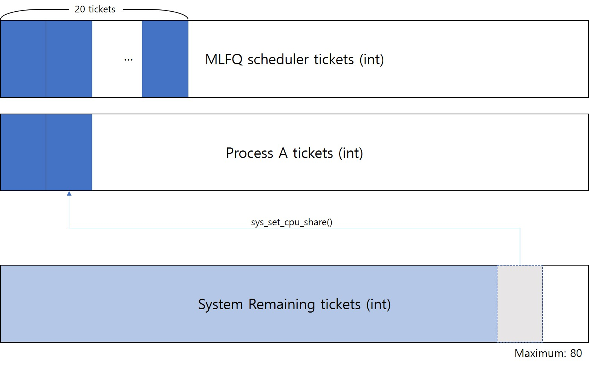

# MLFQ running on Stride

### assume MLFQ as a process on Stride

- to guarantee more than 20% portion of CPU to MLFQ, *<u>consider MLFQ as a process running on the Stride scheduler</u>*, having **20 tickets**.

***

## Further Considerations

- What if there's no processes running on the MLFQ? How can we reduce the overhead that has made by running empty MLFQ?